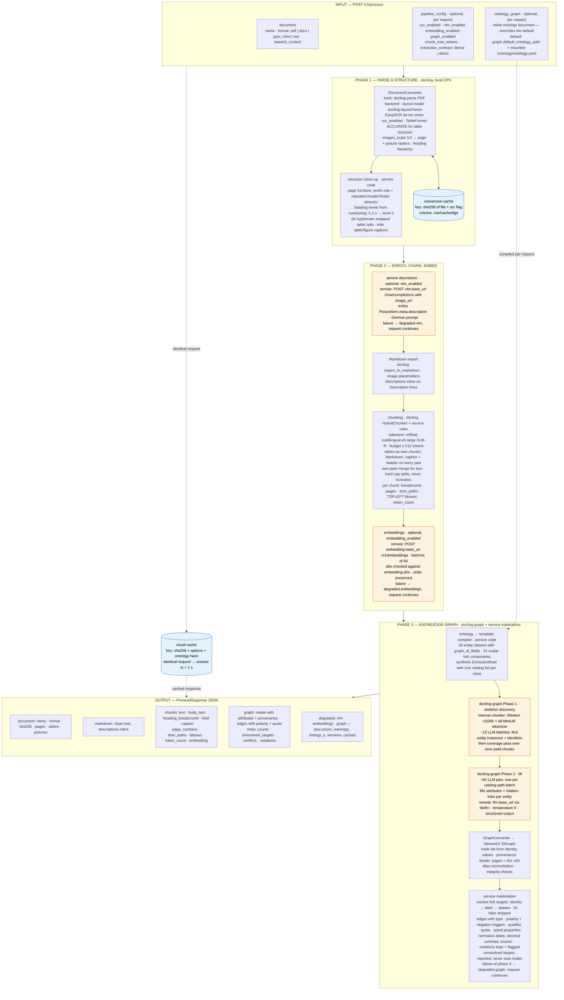

# docling-graph-service — process flow

One `POST /v1/process` (or `dgs process`) runs three phases. Phases 1–2 are local CPU work inside the
container; phase 3 (and the optional VLM/embedding steps in phase 2) call your OpenAI-compatible endpoints.
The percentages you see in the logs (`Phase 1 (skeleton) … Phase 2 (fill) …`) are the two LLM sub-steps of
phase 3.

Orange = steps that call your remote OpenAI-compatible endpoints; blue = caches. Every optional step degrades
gracefully: the response always contains markdown + chunks if the conversion succeeded, with `degraded.*`
flags and `errors[]` explaining what was skipped.

**Ontology as input:** `ontology_graph` in the request body always wins; the mounted
`/ontology/ontology.yaml` (via `graph.default_ontology_path`) is only the fallback when the request omits it.
An invalid inline ontology is rejected with `422` and precise field errors before any processing starts.
Compiled templates are cached per ontology hash, so alternating ontologies costs nothing.
